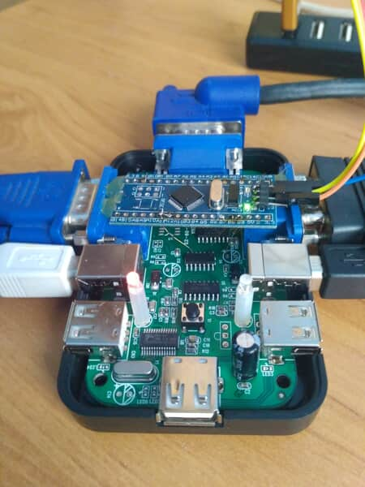

# KVM supervisor
It is really annoying to manually press button to switch output on KVM switch.
VGA connector contains pin 9 - KEY/PWR that provides +5V Supply for EDID memory IC in monitor.
KVM supervisor snoops this pin and when it detects 5V, it checks which LED is switched on.
If it is wrong one, then it pulls button pin low for few ms to simulate manual key press.
Unnamed control IC switches VGA output and USB hub.
Linux can detect switched KVM with connected usb hub udev event.



|                   | STM32F103/BluePill pin |          KVM switch         |
|:-----------------:|:----------------------:|:---------------------------:|
|    Button press   |           PB6          |       control IC pin 2      |
|   VGA +5V detect  |          PB11          | PC2 VGA pin 9 from bot side |
| PC2 switch active |          PA12          |       control IC pin 6      |

## Install udev rule with scripts
```
$ sudo make install_ntb
```
